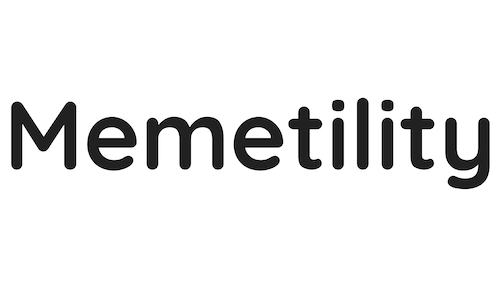

# Memetility White Paper

Welcome to the official repository for the Memetility White Paper. Memetility is an innovative platform initiated by the PIF community, designed to foster creativity and collaboration through the development of blockchain-based features associated with various tokens. This repository provides a comprehensive guide to our vision, mission, and roadmap.

## Overview

Memetility.com is born from the vibrant and proactive PIF community. Our mission is to empower users to create and share unique features that leverage blockchain technology while integrating various tokens. We aim to support the growth and sustainability of community-driven projects and enhance the utility of blockchain technology.

## Vision and Mission

**Vision:**  
To become the leading platform for community-driven feature development and token integration, fostering an environment of innovation, collaboration, and mutual growth.

**Mission:**  
To harness the collective power of the PIF community and beyond, enabling users to easily create, share, and utilize blockchain-based features associated with different tokens.

## White Paper and License

For more detailed information, please refer to the [Memetility White Paper](./Memetility_White_Paper.pdf).

This project is licensed under the terms of the MIT license. See the [LICENSE](./LICENSE) file for details.

---

Join us in building the future of blockchain technology with Memetility. Together, we can achieve greatness!
